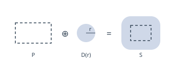
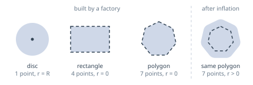
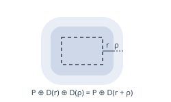
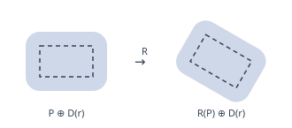
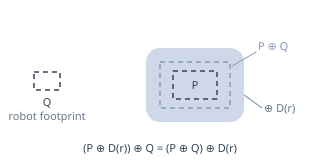
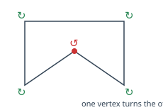

# obstacles_new

An obstacle is a **convex outline** grown by a **corner radius**:

    S = P ⊕ D(r)

`P` is the outline, `D(r)` a disc of radius `r`, and `⊕` the Minkowski sum:
slide the disc all around `P` and keep everything it covers.

| shape     | outline  | radius |
|-----------|----------|--------|
| disc      | 1 point  | R      |
| rectangle | 4 points | 0      |
| polygon   | n points | 0      |

One type, no special case, and each of them is exact rather than approximated.
The radius describes the shape itself: a disc really is that wide, a rectangle
really does have sharp corners.

The same two fields reach further than the factories do. Two points and a radius
are a capsule, and any outline with a radius is what that outline becomes once
it is inflated — so growing an obstacle never introduces a shape the rest of the
code has to learn about.

## Why it is worth it

**Growing an obstacle costs one addition.** Path planning shrinks the robot to
a point and grows every obstacle by its radius. Since

    (P ⊕ D(r)) ⊕ D(ρ) = P ⊕ D(r + ρ)

that whole operation is `corner_radius += ρ`: no polygon offsetting, no corners
to approximate, no vertex budget to tune.

**Moving an obstacle is exact.** A disc looks the same from every angle, so
`R(P ⊕ D(r)) = R(P) ⊕ D(r)`: `set_center()` turns the outline and leaves the
radius alone.

**Collision tests never build the grown shape.** A point is inside `S` when it
lies within `r` of `P`, so every predicate is a polygon predicate plus one
distance comparison.

**A rectangular robot model still fits.** `(P ⊕ D(r)) ⊕ Q = (P ⊕ Q) ⊕ D(r)`,
and the sum of two convex polygons is a convex polygon, obtained by merging
their edges in angular order.

## What it assumes

The outline is stored **counter-clockwise**, which `make_polygon()` normalises,
and holds at most 16 vertices — which also bounds the sum above, since
`|P ⊕ Q| ≤ |P| + |Q|`.

It must also be **convex**, and that one is checked rather than trusted. Where
an outline turns inwards, growing it by a disc makes the grown shape fold over
itself, and a planner reads that fold as free space straight through the
obstacle. Nothing crashes; the path is simply wrong.

The test walks the outline once and asks, at each vertex, which way the two
edges meeting there turn — the sign of their cross product. A convex outline
turns the same way everywhere.

It compares the **squared sine** of that turn
rather than the cross product itself, because the cross product grows with the
size of the obstacle while a sine is a ratio and does not; squaring both sides
then removes the two square roots. Sixteen vertices at most, no square root.

Flat vertices pass, a convex polygon being allowed a redundant one. An outline
that crosses itself slips through: it turns the same way throughout while
looping around twice.
