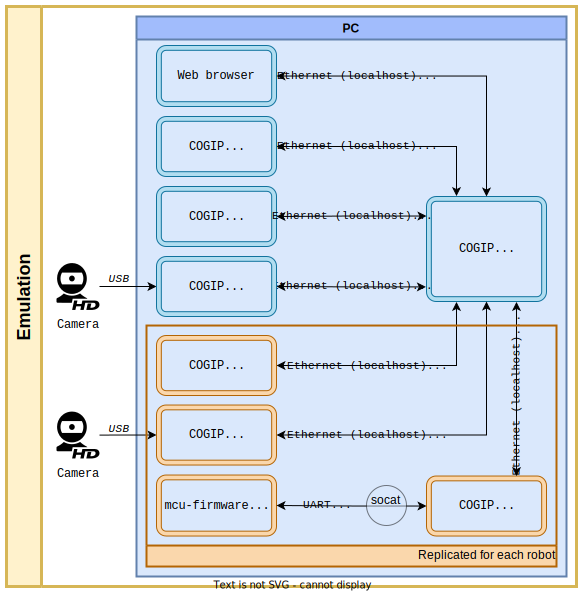

# Overview

This repository provides all Python tools developed by the COGIP robotic team.
The team is developing a robot for [Eurobot](https://www.eurobot.org/), French robotic contest.

All the tools are used during the game itself, or for development, debugging and monitoring of the robot and other test platforms.

## Robot Software Architecture

The main components of the robot are:

  - a STM32 that runs [`mcu-firmware`](https://github.com/cogip/mcu-firmware),
  - a Raspberry Pi 4 that controls a camera, a touchscreen and a Lidar.

The robot is assiocated with a central beacon having an upper view of the game area,
composed of a Raspberry Pi 4, a camera and a touchscreen.

Tools running on the robot's Raspberry Pi 4 are:

  - [`Copilot`](usage/copilot.md) driving the robot moves by communicating
    with `mcu-firmware` (on STM32) using Protobuf messages over a serial port.
  - [`Detector`](usage/detector.md) generating obstacles based on Lidar data.
  - [`Robotcam`](usage/robotcam.md) reading and analyzing images from the camera.

Tools running on the central beacon's Raspberry Pi 4 are:

  - [`Planner`](usage/planner.md) in charge of the game strategy.
  - [`Beaconcam`](usage/beaconcam.md) reading and analyzing images of the game area from the camera.
  - [`Server`](usage/server.md) connecting all components through a SocketIO server.
    It also runs a web server providing a `Dashboard` to control and monitor the robot.

[`Monitor`](usage/monitor.md) is running on a PC connected to the SocketIO server.

[`Dashboard`](usage/dashboard.md) is accessed through a web browser on the same network.

The touchscreens display the `Dashboard` using an web browser embedded in the Raspberry Pi.

## Emulation Software Architecture

During development, an emulation environment is also available. In this case,
all robot and beacon components are running on the development PC.

In this mode, fake Lidar data are provided by the `Monitor`.
