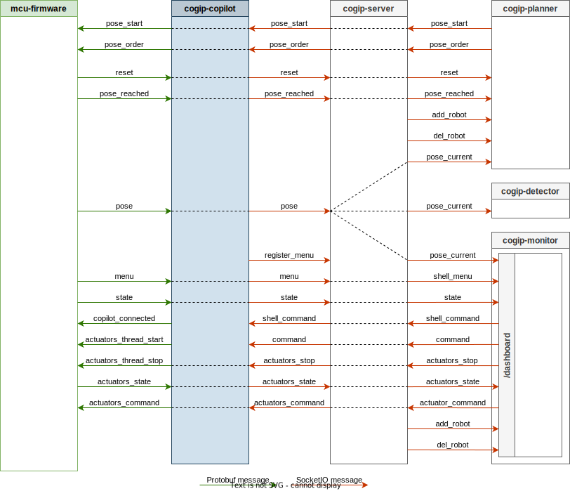

# Copilot

The `Copilot` tool is running on the Raspberry Pi embedded in the robot.

It communicates with `mcu-firmware` on the robot's STM32 over a serial port using Protobuf messages.

It communicates on the `/copilot` namespace of the SocketIO server
running on the central beacon over Wifi.

## Data Flow



## Run Copilot

```bash
$ cogip-copilot
```

## Parameters

`Copilot` default parameters can be modified using command line options or environment variables:

```bash
$ cogip-copilot --help
Usage: cogip-copilot [OPTIONS]

Options:
  --server-url TEXT               Socket.IO Server URL
                                  env var: COGIP_SOCKETIO_SERVER_URL
                                  default: http://localhost:8090

  -i, --id INTEGER RANGE          Robot ID.
                                  env var: ROBOT_ID, COPILOT_ID
                                  default: 1; x>=1

  -p, --serial-port PATH          Serial port connected to STM32 device
                                  env var: COPILOT_SERIAL_PORT
                                  default: /dev/ttyUSB0

  -b, --serial-baudrate INTEGER   Baud rate
                                  env var: COPILOT_BAUD_RATE
                                  default: 230400

  -r, --reload                    Reload app on source file changes
                                  env var: COGIP_RELOAD, COPILOT_RELOAD

  -d, --debug                     Turn on debug messages
                                  env var: COGIP_DEBUG, COPILOT_DEBUG
```
