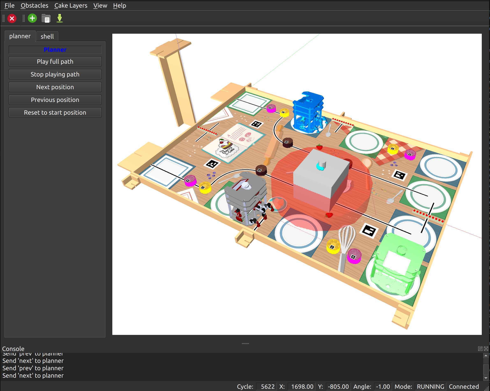
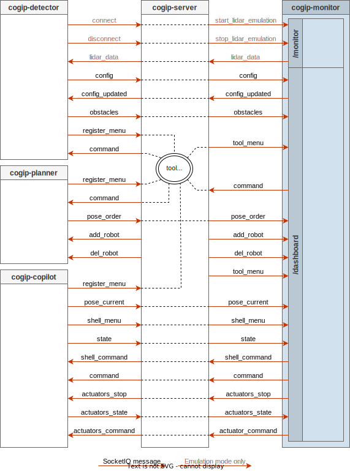

# Monitor

The `Monitor` is used to monitor the robot behavior during the game.

It communicates on the `/monitor` and `/dashboard` namespaces of the SocketIO server
from the `cogip-server` tool.

In emulation mode, it also uses Shared Memory to write Lidar data and read dynamic obstacles.

Only one `Monitor` can be connected to the SocketIO server at the same time.

It can also provide fake Lidar data to `Detector` in emulation mode.

The monitor provides a graphical interface, featuring:

  * a 3D view of the table and the robot

  * a menu giving access to the tools menus

  * a button to add virtual obstacles (in orange) which can be moved and resized

  * save and load virtual obstacles using JSON files

  * visualization of LIDAR (red dots) sensors detections

  * visualization of fix and dynamic obstacles (in transparent red)

  * different artifacts depending of current game rules



## Data Flow



## Run Monitor

To connect the `Monitor` to the `Server` running on the same development PC, run:

```bash
cogip-monitor http://localhost:8091
```

To connect the `Monitor` to the `Server` running on the Raspberry Pi
in the robot, run:

```bash
cogip-monitor http://robot1:8091
```

!!! note "Adapt URL and port depending on `Server` configuration"

## Command line options

```bash
$ cogip-monitor --help
Usage: cogip-monitor [URL]

  Launch COGIP Monitor.

Arguments:
  [URL]        Socket.IO Server URL
               env var: COGIP_SOCKETIO_SERVER_URL
               default: http://localhost:8091
```
