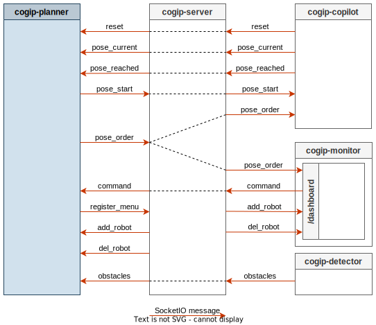

# Planner

The `Planner` tool is running on the Raspberry Pi embedded in the central beacon.

It is in charge computing the strategy and giving orders to the robot during the game.

It communicates on the `/planner` namespace of the SocketIO server.

## Data Flow



## Run Planner

```bash
$ cogip-planner
```

## Parameters

`Planner` default parameters can be modified using command line options or environment variables:

```bash
$ cogip-planner --help
Usage: cogip-planner [OPTIONS]

Options:
  -i, --id INTEGER RANGE          Robot ID.
                                  env var: ROBOT_ID
                                  default: 1; x>=1

  --server-url TEXT               Socket.IO Server URL
                                  env var: COGIP_SOCKETIO_SERVER_URL
                                  default: None

  --obstacle-radius INTEGER       Radius of a dynamic obstacle
                                  env var: PLANNER_OBSTACLE_RADIUS
                                  default: 500

  --obstacle-bb-margin FLOAT      Obstacle bounding box margin in percent of the radius
                                  env var: PLANNER_OBSTACLE_BB_MARGIN
                                  default: 0.2

  --obstacle-bb-vertices INTEGER  Number of obstacle bounding box vertices
                                  env var: PLANNER_OBSTACLE_BB_VERTICES
                                  default: 6

  --obstacle-updater-interval FLOAT
                                  Interval between each obstacles list update (in seconds)
                                  env var: PLANNER_OBSTACLE_UPDATER_INTERVAL
                                  default: 0.2

  --path-refresh-interval FLOAT   Interval between each update of robot paths (in seconds)
                                  env var: PLANNER_PATH_REFRESH_INTERVAL
                                  default: 0.2

  -bd, --bypass-detector          Use perfect obstacles from monitor instead of detected obstacles by Lidar
                                  env var: PLANNER_BYPASS_DETECTOR
                                  default: False

  -sp, --scservos-port PATH       SC Servos serial port
                                  env var: PLANNER_SCSERVOS_PORT
                                  default: None

  -sb, --scservos-baud-rate INTEGER
                                  SC Servos baud rate (usually 921600 or 1000000)
                                  env var: PLANNER_SCSERVOS_BAUD_RATE
                                  default: 921600

  -r, --reload                    Reload app on source file changes
                                  env var: COGIP_RELOAD, PLANNER_RELOAD

  -d, --debug                     Turn on debug messages
                                  env var: COGIP_DEBUG, PLANNER_DEBUG
```
